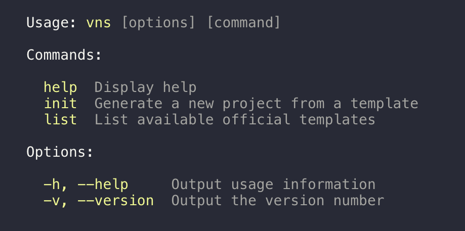

# VNS Package Manager

[](https://travis-ci.org/dangvanthanh/vns-cli)

> Command line interface for web application



## Install

```
$ npm install -g vns-cli
```

## Usage

```
# Generate template
$ vns init gulp-webapp
$ vns init gulp-webapp destinationFolder

# List available templates
$ vns list
```

## Related

- [vns-templates](https://github.com/vns-templates) - List official templates

## License

MIT © [Dang Van Thanh](http://dangthanh.org)
